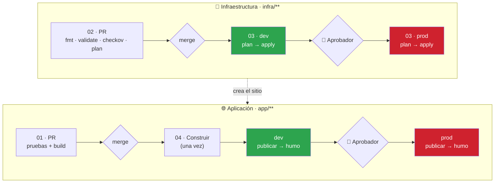
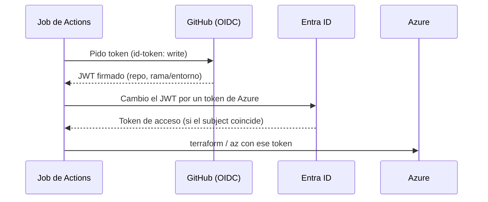

<div align="center">

# ☁️ Taller de CI/CD con GitHub, Terraform y Azure · Edición Enterprise

### Despliega una web en Azure con un pipeline completo, con Copilot de copiloto


**El repositorio ya trae la app, la infraestructura y los workflows. Tu trabajo: conectarlo a Azure, entenderlo, cambiarlo con Copilot y verlo desplegarse solo.**

</div>

---

## 📑 Tabla de contenidos

| | Sección | ⏱️ |
|---|---------|----|
| 🎯 | [Qué vas a construir](#-qué-vas-a-construir) | — |
| 🗺️ | [Cómo está armado](#️-cómo-está-armado) | 5 min |
| 🏢 | [Módulo 0 · Antes de empezar](#-módulo-0--antes-de-empezar) | Previo |
| 1️⃣ | [Módulo 1 · Conectar GitHub con Azure sin secretos (OIDC)](#1️⃣-módulo-1--conectar-github-con-azure-sin-secretos-oidc) | 15 min |
| 2️⃣ | [Módulo 2 · Entornos dev y prod con aprobador](#2️⃣-módulo-2--entornos-dev-y-prod-con-aprobador) | 10 min |
| 3️⃣ | [Módulo 3 · Proteger main](#3️⃣-módulo-3--proteger-main) | 10 min |
| 4️⃣ | [Módulo 4 · Tus primeros despliegues](#4️⃣-módulo-4--tus-primeros-despliegues) | 20 min |
| 5️⃣ | [Módulo 5 · Cambiar con Copilot, por Pull Request](#5️⃣-módulo-5--cambiar-con-copilot-por-pull-request) | 20 min |
| 6️⃣ | [Módulo 6 · Romperlo a propósito](#6️⃣-módulo-6--romperlo-a-propósito) | 10 min |
| 🧹 | [Limpieza](#-limpieza) | 3 min |
| 🩺 | [Problemas frecuentes](#-problemas-frecuentes) | — |
| 🎓 | [Para quien imparte el taller](#-para-quien-imparte-el-taller) | — |

---

## 🎯 Qué vas a construir

| | Resultado |
|---|-----------|
| 🔐 | Autenticación **OIDC**: GitHub entra a Azure **sin contraseñas ni secretos** |
| 🧱 | Infraestructura como código con **Terraform**, con estado remoto en Azure |
| 🔍 | En cada PR: **pruebas, `fmt`, `validate`, escaneo de seguridad (checkov) y `plan` comentado** |
| 🧩 | **Dos pipelines separados**: uno de **infraestructura** (Terraform) y otro de **aplicación** (CI/CD de la web), cada uno por ambiente |
| 📦 | **Construir una sola vez** y desplegar el mismo paquete en **dev** y **prod** |
| 🚦 | **prod** con **aprobador** y solo desde `main`; se aplica **el plan que se aprobó** |
| 🩺 | **Prueba de humo** automática después de cada despliegue |
| 🛡️ | `main` **protegida** con un ruleset |

La app es **Contoso Biker**: una web estática (HTML/CSS/JS) publicada en un **Azure Storage Static Website**. Es sencilla a propósito: el protagonista es el pipeline.

---

## 🗺️ Cómo está armado

### 🧩 Dos pipelines, dos ritmos

La buena práctica es **no mezclar** la infraestructura con el despliegue de la aplicación: cambian con distinta frecuencia, tienen distinto riesgo y suelen revisarlos personas distintas.

| | 🧱 Pipeline de **infraestructura** | 🌐 Pipeline de **aplicación** |
|---|---|---|
| Se dispara con | Cambios en `infra/**` | Cambios en `app/**` |
| Qué hace | `plan` → aprobación → `apply` por ambiente | Pruebas → build → publicar → prueba de humo |
| Frecuencia | Rara | Frecuente |
| Herramienta | Terraform | `az storage blob upload-batch` |
| Workflows | `02` (PR) · `03` (main) | `01` (PR) · `04` (main) |
| Contrato entre ambos | El grupo de recursos `rg-<app>-<ambiente>` | Lo localiza por ese nombre; **no ejecuta Terraform** |



> [!IMPORTANT]
> **El orden importa la primera vez:** primero la infraestructura (03), luego la aplicación (04). Si despliegas la app sin infraestructura, el pipeline falla con un mensaje claro: *"No hay sitio en rg-…. Ejecuta primero 03"*.

```text
.
├── app/                         La web (sin dependencias) + pruebas con node:test
├── infra/                       Terraform
│   ├── modules/sitio-web/       Cuenta de Storage + sitio estático (seguro por omisión)
│   └── environments/            dev.tfvars · prod.tfvars  (lo que cambia por ambiente)
├── scripts/                     bootstrap-azure (.ps1/.sh) · crear-mi-repo · verificar-entorno
└── .github/
    ├── actions/terraform-init/  Action local reutilizable
    └── workflows/
        ├── 01-app-integracion-continua.yml      🌐 Pruebas y paquete de la web (PR)
        ├── 02-infra-validar-y-planificar.yml    🧱 fmt, validate, checkov y plan (PR)
        ├── 03-infra-desplegar.yml               🧱 dev → prod, solo Terraform
        ├── 04-app-desplegar.yml                 🌐 construir → dev → prod, solo la web
        ├── 05-destruir.yml                      🧱 Limpieza manual con confirmación
        ├── 06-deteccion-drift.yml               🧱 Extra: ¿alguien cambió Azure a mano?
        ├── infra-ambiente.yml                   🧱 Reutilizable: plan + apply de UN ambiente
        └── app-ambiente.yml                     🌐 Reutilizable: publicar UN ambiente
```

| Ambiente | Replicación | Soft delete | Versionado | Aprobador |
|---|---|---|---|---|
| `dev` | LRS | 7 días | no | no |
| `prod` | GRS | 30 días | sí | **sí** |

> [!NOTE]
> El mismo código y el mismo paquete van a los dos ambientes. Solo cambian el `.tfvars` y el `config.json` que el pipeline escribe al desplegar.

---

## 🏢 Módulo 0 · Antes de empezar

### 1 · Herramientas

| Herramienta | Comprobación |
|-------------|--------------|
| **Git** | `git --version` |
| **GitHub CLI** | `gh --version` |
| **Azure CLI** | `az version` |
| **Terraform ≥ 1.9** | `terraform version` |
| **Node.js ≥ 22** | `node -v` |

Y VS Code con **GitHub Copilot** y la extensión de **HashiCorp Terraform**.

### 2 · Permisos en Azure

Necesitas **Owner** (o *Contributor* + *User Access Administrator*) en una suscripción, y permiso para registrar aplicaciones en Entra ID. Las dos cosas son necesarias porque el script del Módulo 1 crea una identidad y le asigna roles.

### 3 · Autentícate

```bash
gh auth login
gh auth setup-git
az login
az account set --subscription <TU-SUSCRIPCION>
```

### 4 · Crea tu copia del taller

**🪟 PowerShell**

```powershell
Invoke-WebRequest -UseBasicParsing -OutFile crear-mi-repo.ps1 -Uri https://raw.githubusercontent.com/JordanReyesLeger/github-workflows-workshop-azure-ci-cd-enterprise/main/scripts/crear-mi-repo.ps1
powershell -ExecutionPolicy Bypass -File .\crear-mi-repo.ps1 -Organizacion MI-ORG -Nombre taller-azure-TU-USUARIO
cd taller-azure-TU-USUARIO
```

**🐧🍎 bash**

```bash
curl -fsSL -o crear-mi-repo.sh https://raw.githubusercontent.com/JordanReyesLeger/github-workflows-workshop-azure-ci-cd-enterprise/main/scripts/crear-mi-repo.sh
bash crear-mi-repo.sh MI-ORG taller-azure-TU-USUARIO
cd taller-azure-TU-USUARIO
```

> [!IMPORTANT]
> Los entornos con aprobadores en repos **privados** requieren GitHub Enterprise/Team según tu plan. En un repo **público** funcionan siempre. Si usas cuenta **EMU**, usa el script (no *Use this template* ni fork).

### 5 · Comprueba que todo arranca

```powershell
./scripts/verificar-entorno.ps1      # o: bash scripts/verificar-entorno.sh
```

Deberías ver todo en `[OK]`. Si quieres ver la web en local: `cd app; npm run build; npm start` → <http://localhost:8080>.

---

## 1️⃣ Módulo 1 · Conectar GitHub con Azure sin secretos (OIDC)

> ⏱️ **15 minutos**

### 🎯 Qué vas a lograr

Que el pipeline despliegue en Azure **sin guardar ninguna contraseña**. En cada ejecución GitHub presenta un token firmado y temporal; Azure lo acepta solo si coincide con una **credencial federada** que tú configuraste.



### 🤖 Paso 1 · Pídeselo a Copilot (para entenderlo)

```text
Explícame qué hace scripts/bootstrap-azure.ps1, paso por paso, y por qué crea
cuatro credenciales federadas (pull_request, rama main, entorno dev, entorno prod).
```

### ▶️ Paso 2 · Ejecútalo

Es **idempotente**: puedes repetirlo.

```powershell
./scripts/bootstrap-azure.ps1 `
  -Repositorio MI-ORG/taller-azure-TU-USUARIO `
  -SuscripcionId <TU-SUSCRIPCION-ID> `
  -NombreApp tallerana
```

```bash
bash scripts/bootstrap-azure.sh MI-ORG/taller-azure-TU-USUARIO <TU-SUSCRIPCION-ID> tallerana
```

`NombreApp`: de 3 a 12 caracteres, minúsculas y números. Crea:

| Qué | Para qué |
|---|---|
| Grupo + cuenta `sttf…` con contenedor `tfstate` | **Estado remoto** de Terraform (versionado, sin llaves, sin acceso anónimo) |
| App de Entra ID `gh-MI-ORG-…` + 4 credenciales federadas | La identidad del pipeline |
| Roles `Contributor` y `Storage Blob Data Contributor` | Lo mínimo para crear recursos y publicar el sitio |
| 9 **variables** del repo (no secretos) | `AZURE_CLIENT_ID`, `AZURE_TENANT_ID`, `AZURE_SUBSCRIPTION_ID`, `TFSTATE_*`, `NOMBRE_APP`, `UBICACION`, `ETIQUETAS_EXTRA` |

Verifica:

```bash
gh variable list -R MI-ORG/taller-azure-TU-USUARIO
```

### ✅ Paso 3 · Entiende estos detalles

| Detalle | Por qué importa |
|---|---|
| **Cero secretos** | Nada que rotar, filtrar o caducar. `AZURE_CLIENT_ID` no es un secreto |
| **El *subject* es exacto** | Azure compara el texto carácter a carácter. Un entorno `prod` solo funciona si existe la credencial `…:environment:prod` |
| **Subject inmutable** | GitHub puede emitir `repo:ORG@<id>/REPO@<id>:…` (con IDs numéricos) en lugar de nombres. El script **lo consulta** con `gh api repos/ORG/REPO/actions/oidc/customization/sub` para que coincida |
| **Contributor en la suscripción** | Es simple para un taller. En producción real: acota al grupo de recursos y evita dar *Owner* |

> [!WARNING]
> **Política de tu suscripción.** Algunas suscripciones corporativas bloquean cuentas de almacenamiento con red pública y el script falla al crear el contenedor con *"request may be blocked by network rules"*. Pide a tu administrador una excepción, o usa el parámetro `-Etiquetas clave=valor` para añadir la etiqueta de exención que tu organización use; el valor se propaga también a los recursos de Terraform (`ETIQUETAS_EXTRA`).

---

## 2️⃣ Módulo 2 · Entornos dev y prod con aprobador

> ⏱️ **10 minutos**

### 🎯 Qué vas a lograr

Dos entornos de GitHub: `dev` libre y `prod` con **aprobador** y **solo desde `main`**.

### 🤖 Paso 1 · Pídeselo a Copilot

```text
Dame los comandos de GitHub CLI para, en el repo MI-ORG/TU-REPO, crear el entorno
"dev" sin protecciones y el entorno "prod" con mi usuario como required reviewer,
prevent_self_review en false y despliegue permitido solo desde la rama main.
```

### ▶️ Paso 2 · Ejecuta (PowerShell o bash)

```bash
ID=$(gh api user --jq .id)
gh api -X PUT repos/MI-ORG/TU-REPO/environments/dev
echo "{\"reviewers\":[{\"type\":\"User\",\"id\":$ID}],\"prevent_self_review\":false,\"deployment_branch_policy\":{\"protected_branches\":false,\"custom_branch_policies\":true}}" \
  | gh api -X PUT repos/MI-ORG/TU-REPO/environments/prod --input -
gh api -X POST repos/MI-ORG/TU-REPO/environments/prod/deployment-branch-policies -f name=main -f type=branch
```

> En PowerShell sustituye `$ID=` / `echo` por: `$id = gh api user --jq .id` y construye el JSON con `@{...} | ConvertTo-Json -Depth 5 | gh api -X PUT ... --input -`.

También puedes hacerlo en **Settings → Environments**. En el taller desmarca *Prevent self-review* para poder aprobar tu propio despliegue; en la vida real, un **equipo** distinto aprueba.

### ✅ Paso 3 · Qué revisar

| Revisa | Debe estar |
|---|---|
| `prod` → *Required reviewers* | Tú (o un equipo) |
| `prod` → *Deployment branches* | Solo `main` |
| Variables por entorno | **Ninguna necesaria**: todo vive en `infra/environments/*.tfvars` |

> [!TIP]
> El entorno también **protege la identidad**: el token OIDC del job incluye `environment:prod`, así que si alguien crea un job sin ese entorno, Azure rechaza el login.

---

## 3️⃣ Módulo 3 · Proteger main

> ⏱️ **10 minutos**

### 🎯 Qué vas a lograr

Que nadie empuje directo a `main`: todo entra por PR y con **CI + plan en verde**.

### ▶️ Paso 1 · Ajusta CODEOWNERS

`crear-mi-repo` ya puso tu usuario. En una empresa, cámbialo por **equipos** (`@mi-org/plataforma`) para `/infra/` y `/.github/`.

### ▶️ Paso 2 · Aplica el ruleset

El repo trae [`.github/ruleset-main.json`](.github/ruleset-main.json):

```bash
gh api -X POST repos/MI-ORG/TU-REPO/rulesets --input .github/ruleset-main.json
```

| Regla | Efecto |
|---|---|
| `pull_request` | Solo por PR, conversaciones resueltas |
| `required_status_checks` | Deben pasar `Construir y probar`, `Formato, validación y seguridad`, `Plan (dev)`, `Plan (prod)` |
| `non_fast_forward` y `deletion` | No se reescribe ni borra la historia de `main` |

> [!NOTE]
> Aplícalo **después** del Módulo 4: los checks deben haberse ejecutado al menos una vez para que GitHub los reconozca. Con un único autor, `required_approving_review_count` queda en 0; sube a 1 en tu equipo real.

---

## 4️⃣ Módulo 4 · Tus primeros despliegues

> ⏱️ **20 minutos** · Hazlo antes del Módulo 3 si es tu primera vez

### 🎯 Qué vas a lograr

Ver nacer la infraestructura y, después, la web, cada una con su propio pipeline.

### ▶️ Paso 1 · Primero la infraestructura

```bash
gh workflow run 03-infra-desplegar.yml -R MI-ORG/TU-REPO --ref main
gh run watch -R MI-ORG/TU-REPO
```

| Job | Qué hace | Qué revisar |
|---|---|---|
| `dev / Planificar` | `terraform plan` guardado como artefacto | El plan en el *Summary*: `3 to add` |
| `dev / Aplicar` | `apply` del **plan guardado** | La URL del sitio en el *Summary* |
| `prod / Planificar` | Plan de prod | Réplica **GRS** y versionado |
| `prod / Aplicar` | Espera tu **aprobación** | Botón **Review deployments** |

### ▶️ Paso 2 · Después la aplicación

```bash
gh workflow run 04-app-desplegar.yml -R MI-ORG/TU-REPO --ref main
gh run watch -R MI-ORG/TU-REPO
```

| Job | Qué hace | Qué revisar |
|---|---|---|
| `Construir y probar` | `npm test` + `npm run build`, sube el artefacto `sitio-web` | Pestaña *Summary* con los archivos |
| `dev / Publicar` | Localiza el sitio, escribe `config.json`, sube a `$web`, **prueba de humo** | La URL aparece en el entorno del run |
| `prod / Publicar` | Espera tu **aprobación** | Botón **Review deployments** |

Aprueba `prod` y abre las dos URLs (están en el resumen y en **Environments**). Cada página muestra su **ambiente, versión y commit**, escritos por el pipeline.

### 💡 Paso 3 · Por qué está hecho así

| Decisión | Razón |
|---|---|
| **Plan separado del apply** | Lo que se aprueba es el plan; el `apply` ejecuta ese archivo. Si algo cambia entre medias, Terraform responde `Saved plan is stale` y se niega: seguro, pero vuelve a lanzar el run |
| **Dos pipelines separados** | Un cambio de CSS no ejecuta Terraform; un cambio de infraestructura no republica la web. Menos riesgo, menos espera y revisores distintos (ver `CODEOWNERS`) |
| **Un workflow reutilizable por pipeline** (`infra-ambiente.yml`, `app-ambiente.yml`) | dev y prod se despliegan **idéntico**; no hay dos copias que diverjan |
| **`concurrency` separada** (`infra-desplegar` / `app-desplegar`) | Un despliegue de app no espera a uno de infraestructura, pero nunca hay dos `apply` a la vez |
| **Artefacto único `sitio-web`** | Se construye una vez; lo que probaste en dev es lo que llega a prod |
| **`concurrency` sin cancelar** | Nunca se interrumpe un `apply` a la mitad |
| **Estado por ambiente** (`dev.tfstate`, `prod.tfstate`) | Destruir dev no toca prod |
| **Storage sin llaves** (`shared_access_key_enabled = false`) | Se publica con la identidad OIDC; no existe una llave que filtrar |

> [!IMPORTANT]
> 🏢 Si tu organización exige acciones **fijadas por SHA**, reemplaza `@v7` por el SHA de 40 caracteres: `gh api repos/actions/checkout/git/ref/tags/v7 --jq .object.sha`. Dependabot (ya configurado) mantiene también esos SHA.

---

## 5️⃣ Módulo 5 · Cambiar con Copilot, por Pull Request

> ⏱️ **20 minutos**

### 🎯 Qué vas a lograr

El ciclo diario: pides un cambio a Copilot, abres un PR, lees el **plan** y haces merge.

### 🤖 Paso 1 · Un cambio de aplicación

```text
En app/src/index.html cambia el precio de la bicicleta eléctrica de $550 a $600
por día. No toques nada más.
```

### 🤖 Paso 2 · Un cambio de infraestructura

```text
En infra/main.tf agrega la etiqueta "centro-costo" con el valor "taller" a
local.etiquetas. Mantén el formato de terraform fmt.
```

### ▶️ Paso 3 · Súbelo

```bash
terraform -chdir=infra fmt -check -recursive
git switch -c feature/mi-cambio
git add . && git commit -m "feat: precio y etiqueta de costos"
git push -u origin feature/mi-cambio
gh pr create --fill --base main
```

### ✅ Paso 4 · Revisa (lo que importa)

| Revisa | Qué debes ver |
|---|---|
| Checks del PR | `Construir y probar`, `Formato, validación y seguridad`, `Plan (dev)`, `Plan (prod)` en ✅ |
| **Comentario del plan** | `~ update in-place` sobre las etiquetas. **Ningún** `destroy` ni `must be replaced` |
| Copilot → *Reviewers* | Pídele que revise el PR |

> [!WARNING]
> **Lee el plan siempre.** Un cambio de una línea puede decir `-/+ destroy and then create replacement`. Esa es la señal de que se **recrearía** un recurso (y en Storage, perdería datos). Para eso existe el comentario en el PR.

Haz **merge (squash)**. Cada cambio lanza **solo su pipeline** (gracias a los filtros `paths`):

| Cambiaste | Se lanza | No se lanza |
|---|---|---|
| `app/**` (el precio) | `04 · App` → dev solo; prod cuando apruebes | `03 · Infra` |
| `infra/**` (la etiqueta) | `03 · Infra` → dev solo; prod cuando apruebes | `04 · App` |

Refresca las URLs: el precio y la **versión** (`1.0.N`) cambiaron. Si cambiaste ambos en un mismo PR, corren los dos, en paralelo.

---

## 6️⃣ Módulo 6 · Romperlo a propósito

> ⏱️ **10 minutos** · El que más enseña

### 💥 Prueba A · Que el escáner de seguridad te frene

En `infra/modules/sitio-web/main.tf` cambia `min_tls_version = "TLS1_2"` a `"TLS1_0"`, y haz PR.

`Formato, validación y seguridad` falla ❌ con `CKV_AZURE_44`. El error llegó **antes** de tocar Azure. Usa el botón **Explain error** de Copilot, revierte y sigue.

### 💥 Prueba B · Que una prueba falle

En `app/src/index.html` borra `id="dato-commit"`. `Construir y probar` falla: la prueba comprueba que existan los elementos que el pipeline rellena.

### 💥 Prueba C · Drift

En el portal de Azure cambia a mano una etiqueta del grupo `rg-<app>-dev`. Lanza el extra `05 · Detección de drift`: falla y te dice que Azure difiere del código.

```bash
gh workflow run 06-deteccion-drift.yml -R MI-ORG/TU-REPO
```

### 🧠 Qué se aprendió

| Capa | Atrapa |
|---|---|
| Pruebas (01) | Un cambio que rompe la web |
| `fmt` / `validate` (02) | Código Terraform mal escrito |
| checkov (02) | Configuración **insegura** |
| `plan` en el PR (02) | Efectos **reales** en Azure, antes del merge |
| Aprobador en prod | Un humano decide el último paso |
| Prueba de humo | El despliegue "terminó" pero **el sitio no responde** |
| Drift (05) | Cambios manuales fuera del código |

---

## 🧹 Limpieza

Para no dejar recursos facturando:

```bash
gh workflow run 05-destruir.yml -R MI-ORG/TU-REPO -f ambiente=dev  -f confirmar=dev
gh workflow run 05-destruir.yml -R MI-ORG/TU-REPO -f ambiente=prod -f confirmar=prod
```

`prod` pedirá aprobación. Después elimina el estado y la identidad:

```bash
az group delete --name rg-tfstate-<NOMBRE_APP> --yes --no-wait
az ad app delete --id <AZURE_CLIENT_ID>
```

Los roles asignados a esa identidad desaparecen con ella. Coste aproximado del taller: **céntimos** (Storage estándar, sin cómputo).

---

## 🩺 Problemas frecuentes

| Síntoma | Causa | Solución |
|---|---|---|
| `AADSTS700213: No matching federated identity record … subject 'repo:ORG@id/REPO@id:…'` | La credencial federada no coincide con el subject real | Vuelve a ejecutar `bootstrap-azure` (lo consulta y **actualiza** las credenciales) |
| `AADSTS700213 … environment:prod` | Falta la credencial del entorno o el job no declara `environment:` | Revisa que existan las 4 credenciales y el nombre del entorno |
| `No hay sitio en rg-…` al desplegar la app | La infraestructura aún no existe en ese ambiente | Ejecuta primero `03 · Infra · desplegar` |
| `Saved plan is stale` | El estado de Azure cambió entre el plan y el apply | Relanza el workflow: genera un plan nuevo |
| `Error: Failed to get existing workspaces … 403` | Falta `Storage Blob Data Contributor` o aún no propagó | Espera 1–2 min y relanza |
| `request may be blocked by network rules` / `RequestDisallowedByPolicy` | Una *Azure Policy* bloquea la red pública o falta una etiqueta | Mira [Módulo 1](#1️⃣-módulo-1--conectar-github-con-azure-sin-secretos-oidc) (aviso de política) |
| El job de `prod` queda "Waiting" | Espera tu aprobación | **Review deployments** en la página del run |
| `Repository not found` al hacer push | git usa otra cuenta | `gh auth setup-git` / `gh auth switch` |
| El nombre de cuenta de Storage ya existe | Los nombres son globales | Cambia `NOMBRE_APP` y repite el bootstrap |
| La URL del sitio da `ResourceNotFound` unos segundos | El endpoint tarda en activarse | La prueba de humo **reintenta** hasta 2 min |

---

## 🎓 Para quien imparte el taller

| Tema | Nota |
|---|---|
| **Duración** | 90 min. Si falta tiempo: omite el Módulo 3 y la Prueba C |
| **Antes de la sesión** | Cada asistente debe tener suscripción con **Owner** y poder crear apps en Entra ID. Pide que ejecuten el Módulo 0 antes |
| **Cuello de botella** | El primer `apply` tarda ~2 min (crear Storage) y el de prod con GRS, un poco más. Aprovecha para explicar el diagrama |
| **Cuidado con** | Aprobar `prod` desde **otra** cuenta si activas *Prevent self-review* |
| **Validado** | El flujo completo se ejecutó de punta a punta: bootstrap, CI, plan en PR, apply dev, aprobación, apply prod, prueba de humo, ruleset y merge por PR |

### 📚 Recursos

- [OIDC con Azure en GitHub Actions](https://docs.github.com/actions/how-tos/secure-your-work/security-harden-deployments/oidc-in-azure)
- [Proveedor azurerm](https://registry.terraform.io/providers/hashicorp/azurerm/latest/docs)
- [Static website en Azure Storage](https://learn.microsoft.com/azure/storage/blobs/storage-blob-static-website)
- [Taller de fundamentos (este es su continuación)](https://github.com/JordanReyesLeger/github-workflows-workshop-fundamentos-enterprise)

<div align="center">

Hecho con ❤️ y Copilot · Licencia MIT

</div>
