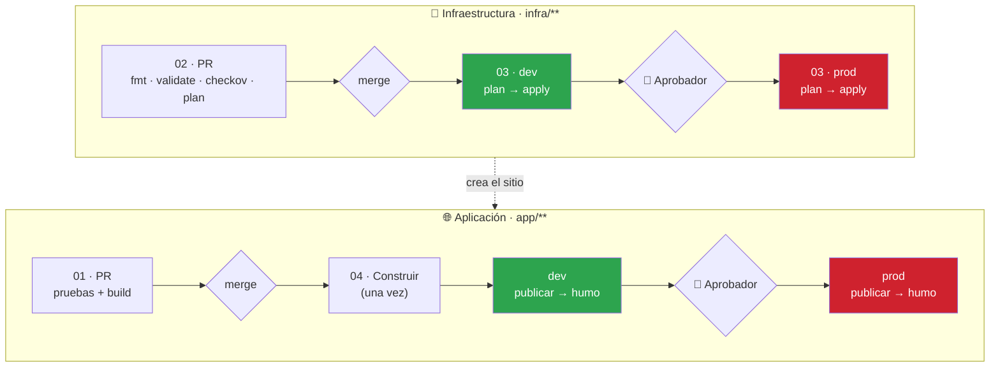
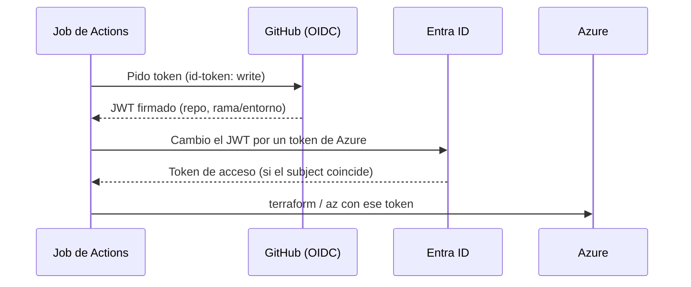

<div align="center">

# ☁️ Taller de CI/CD con GitHub, Terraform y Azure · Edición Enterprise

### Despliega una web en Azure con un pipeline completo, con Copilot de copiloto


**El repositorio ya trae la app, la infraestructura y los workflows. Tu trabajo: conectarlo a Azure, entenderlo, cambiarlo con Copilot y verlo desplegarse solo.**

</div>

---

## 📑 Tabla de contenidos

| | Sección | ⏱️ |
|---|---------|----|
| 🎯 | [Qué vas a construir](#-qué-vas-a-construir) | — |
| 🗺️ | [Cómo está armado](#️-cómo-está-armado) | 5 min |
| 🏢 | [Módulo 0 · Antes de empezar](#-módulo-0--antes-de-empezar) | Previo |
| 1️⃣ | [Módulo 1 · Conectar GitHub con Azure sin secretos (OIDC)](#1️⃣-módulo-1--conectar-github-con-azure-sin-secretos-oidc) | 30 min |
| 2️⃣ | [Módulo 2 · Entornos dev y prod con aprobador](#2️⃣-módulo-2--entornos-dev-y-prod-con-aprobador) | 10 min |
| 3️⃣ | [Módulo 3 · Proteger main](#3️⃣-módulo-3--proteger-main) | 10 min |
| 4️⃣ | [Módulo 4 · Tus primeros despliegues](#4️⃣-módulo-4--tus-primeros-despliegues) | 20 min |
| 5️⃣ | [Módulo 5 · Cambiar con Copilot, por Pull Request](#5️⃣-módulo-5--cambiar-con-copilot-por-pull-request) | 20 min |
| 6️⃣ | [Módulo 6 · Romperlo a propósito](#6️⃣-módulo-6--romperlo-a-propósito) | 10 min |
| 🧹 | [Limpieza](#-limpieza) | 3 min |
| 🩺 | [Problemas frecuentes](#-problemas-frecuentes) | — |
| 🎓 | [Para quien imparte el taller](#-para-quien-imparte-el-taller) | — |

---

## 🎯 Qué vas a construir

| | Resultado |
|---|-----------|
| 🔐 | Autenticación **OIDC**: GitHub entra a Azure **sin contraseñas ni secretos** |
| 🧱 | Infraestructura como código con **Terraform**, con estado remoto en Azure |
| 🔍 | En cada PR: **pruebas, `fmt`, `validate`, escaneo de seguridad (checkov) y `plan` comentado** |
| 🧩 | **Dos pipelines separados**: uno de **infraestructura** (Terraform) y otro de **aplicación** (CI/CD de la web), cada uno por ambiente |
| 📦 | **Construir una sola vez** y desplegar el mismo paquete en **dev** y **prod** |
| 🚦 | **prod** con **aprobador** y solo desde `main`; se aplica **el plan que se aprobó** |
| 🩺 | **Prueba de humo** automática después de cada despliegue |
| 🛡️ | `main` **protegida** con un ruleset |

La app es **Contoso Biker**: una web estática (HTML/CSS/JS) publicada en un **Azure Storage Static Website**. Es sencilla a propósito: el protagonista es el pipeline.

---

## 🗺️ Cómo está armado

### 🧩 Dos pipelines, dos ritmos

La buena práctica es **no mezclar** la infraestructura con el despliegue de la aplicación: cambian con distinta frecuencia, tienen distinto riesgo y suelen revisarlos personas distintas.

| | 🧱 Pipeline de **infraestructura** | 🌐 Pipeline de **aplicación** |
|---|---|---|
| Se dispara con | Cambios en `infra/**` | Cambios en `app/**` |
| Qué hace | `plan` → aprobación → `apply` por ambiente | Pruebas → build → publicar → prueba de humo |
| Frecuencia | Rara | Frecuente |
| Herramienta | Terraform | `az storage blob upload-batch` |
| Workflows | `02` (PR) · `03` (main) | `01` (PR) · `04` (main) |
| Contrato entre ambos | El grupo de recursos `rg-<app>-<ambiente>` | Lo localiza por ese nombre; **no ejecuta Terraform** |



> [!IMPORTANT]
> **El orden importa la primera vez:** primero la infraestructura (03), luego la aplicación (04). Si despliegas la app sin infraestructura, el pipeline falla con un mensaje claro: *"No hay sitio en rg-…. Ejecuta primero 03"*.

```text
.
├── app/                         La web (sin dependencias) + pruebas con node:test
├── infra/                       Terraform
│   ├── modules/sitio-web/       Cuenta de Storage + sitio estático (seguro por omisión)
│   └── environments/            dev.tfvars · prod.tfvars  (lo que cambia por ambiente)
├── scripts/                     bootstrap-azure (.ps1/.sh) · crear-mi-repo · verificar-entorno
└── .github/
    ├── actions/terraform-init/  Action local reutilizable
    └── workflows/
        ├── 01-app-integracion-continua.yml      🌐 Pruebas y paquete de la web (PR)
        ├── 02-infra-validar-y-planificar.yml    🧱 fmt, validate, checkov y plan (PR)
        ├── 03-infra-desplegar.yml               🧱 dev → prod, solo Terraform
        ├── 04-app-desplegar.yml                 🌐 construir → dev → prod, solo la web
        ├── 05-destruir.yml                      🧱 Limpieza manual con confirmación
        ├── 06-deteccion-drift.yml               🧱 Extra: ¿alguien cambió Azure a mano?
        ├── infra-ambiente.yml                   🧱 Reutilizable: plan + apply de UN ambiente
        └── app-ambiente.yml                     🌐 Reutilizable: publicar UN ambiente
```

| Ambiente | Replicación | Soft delete | Versionado | Aprobador |
|---|---|---|---|---|
| `dev` | LRS | 7 días | no | no |
| `prod` | GRS | 30 días | sí | **sí** |

> [!NOTE]
> El mismo código y el mismo paquete van a los dos ambientes. Solo cambian el `.tfvars` y el `config.json` que el pipeline escribe al desplegar.

---

## 🏢 Módulo 0 · Antes de empezar

> [!NOTE]
> **Este taller se hace desde el navegador.** Solo necesitas la interfaz de GitHub y el portal de Azure. Cada paso que también tiene versión de terminal la trae dentro de un bloque plegable **💻 Con terminal**.

### 1 · Qué necesitas

| Necesitas | Detalle |
|-----------|---------|
| 🐙 **Cuenta de GitHub** | Con permiso para crear repositorios (en tu organización, si usas una) y con **GitHub Copilot** |
| ☁️ **Suscripción de Azure** | Rol **Owner** (o *Contributor* + *User Access Administrator*) |
| 🪪 **Entra ID** | Permiso para **registrar aplicaciones** (App registrations) |
| 🌐 **Un navegador** | Inicia sesión en <https://github.com> y <https://portal.azure.com> |

> [!IMPORTANT]
> Los entornos con aprobadores en repositorios **privados** requieren GitHub Enterprise/Team según tu plan. En un repositorio **público** funcionan siempre.

<details>
<summary>💻 <b>Opcional · herramientas locales</b> (solo si quieres correr la app o Terraform en tu máquina)</summary>

| Herramienta | Comprobación |
|-------------|--------------|
| Git | `git --version` |
| GitHub CLI | `gh --version` |
| Azure CLI | `az version` |
| Terraform ≥ 1.9 | `terraform version` |
| Node.js ≥ 22 | `node -v` |

```bash
gh auth login && gh auth setup-git
az login && az account set --subscription <TU-SUSCRIPCION>
./scripts/verificar-entorno.ps1      # o: bash scripts/verificar-entorno.sh
```

Para ver la web en local: `cd app; npm run build; npm start` → <http://localhost:8080>.

</details>

### 2 · Crea tu copia del taller (desde la UI)

1. Abre <https://github.com/JordanReyesLeger/github-workflows-workshop-azure-ci-cd-enterprise>.
2. Pulsa el botón verde **Use this template** → **Create a new repository**.
3. En **Owner** elige **tu organización** (o tu usuario), en **Repository name** escribe `taller-azure-TU-USUARIO`.
4. Elige **Private** (o **Internal**) y pulsa **Create repository**.

> [!WARNING]
> Si tu cuenta es **Enterprise Managed User (EMU)**, GitHub no te deja usar plantillas de fuera de la empresa (ni fork). Usa el script de abajo.

> [!NOTE]
> Al crearse la copia, GitHub lanza los workflows y **fallan**. Es normal: todavía no existen las variables ni la identidad de Azure. Se arregla en los Módulos 1 y 2.

### 3 · Cambia el dueño del código (CODEOWNERS)

La plantilla trae `@TU_USUARIO` como marcador. Ábrelo y cámbialo:

1. En tu repo abre `.github/CODEOWNERS` → lápiz ✏️.
2. Reemplaza `@TU_USUARIO` por tu usuario (en una empresa, mejor un **equipo**: `@mi-org/plataforma`). Son tres apariciones.
3. **Commit changes…** → **Commit directly to the `main` branch** → **Commit changes**.

<details>
<summary>💻 <b>Con terminal</b> · crea la copia con un script (funciona también con EMU)</summary>

```powershell
Invoke-WebRequest -UseBasicParsing -OutFile crear-mi-repo.ps1 -Uri https://raw.githubusercontent.com/JordanReyesLeger/github-workflows-workshop-azure-ci-cd-enterprise/main/scripts/crear-mi-repo.ps1
powershell -ExecutionPolicy Bypass -File .\crear-mi-repo.ps1 -Organizacion MI-ORG -Nombre taller-azure-TU-USUARIO
```

```bash
curl -fsSL -o crear-mi-repo.sh https://raw.githubusercontent.com/JordanReyesLeger/github-workflows-workshop-azure-ci-cd-enterprise/main/scripts/crear-mi-repo.sh
bash crear-mi-repo.sh MI-ORG taller-azure-TU-USUARIO
```

Este script también reemplaza `@TU_USUARIO` por ti.

</details>

---

## 1️⃣ Módulo 1 · Conectar GitHub con Azure sin secretos (OIDC)

> ⏱️ **30 minutos** (10 con el atajo del script)

### 🎯 Qué vas a lograr

Que el pipeline despliegue en Azure **sin guardar ninguna contraseña**. En cada ejecución GitHub presenta un token firmado y temporal; Azure lo acepta solo si coincide con una **credencial federada** que tú configuraste.



Vas a crear **tres cosas en Azure** y **una en GitHub**:

| # | Dónde | Qué | Para qué |
|---|---|---|---|
| A | Azure Portal | Cuenta de almacenamiento + contenedor `tfstate` | **Estado remoto** de Terraform |
| B | Azure Portal | App registration + 4 credenciales federadas | La **identidad** del pipeline |
| C | Azure Portal | 2 asignaciones de rol | Permisos mínimos para desplegar |
| D | GitHub | Variables del repositorio | Le dicen al pipeline a qué Azure conectarse |

### 🤖 Paso 0 · Pídele a Copilot que te lo explique

```text
Explícame cómo funciona OIDC entre GitHub Actions y Azure, y por qué necesito
cuatro credenciales federadas (pull_request, rama main, entorno dev, entorno prod).
```

### 🅰️ Paso 1 · Cuenta de almacenamiento para el estado de Terraform

En el [portal de Azure](https://portal.azure.com):

1. Busca **Storage accounts** → **Create**.
2. **Basics**: suscripción tuya; **Resource group** → *Create new* → `rg-tfstate-<NOMBREAPP>`; **Storage account name** → `sttf<nombreapp><3 letras al azar>` (solo minúsculas y números, global y único); **Region** `East US 2`; **Performance** Standard; **Redundancy** **LRS**.
3. **Advanced**: ✅ *Require secure transfer*, **Minimum TLS version 1.2**, ❌ **desmarca** *Allow enabling anonymous access on individual containers*, ❌ **desmarca** *Allow storage account key access*.
4. **Networking**: *Public network access* → **Enable** (selected networks no sirve: los runners de GitHub cambian de IP).
5. **Data protection**: ✅ *Enable versioning for blobs*.
6. **Review + create** → **Create**.
7. Abre la cuenta → **Data storage → Containers** → **+ Container** → nombre `tfstate` → **Create**.

> [!NOTE]
> `NOMBREAPP`: de 3 a 12 caracteres, minúsculas y números (ej. `tallerana`). Lo usarás en el paso 4.

> [!WARNING]
> Si al crear el contenedor ves *"This request is not authorized"*, te falta permiso de datos: en la cuenta → **Access control (IAM)** → **Add → Add role assignment** → **Storage Blob Data Contributor** → tú mismo. Espera 1–2 minutos y reintenta.

### 🅱️ Paso 2 · La identidad del pipeline (App registration)

1. Busca **Microsoft Entra ID** → **App registrations** → **+ New registration**.
2. **Name**: `gh-taller-azure-TU-USUARIO` · **Supported account types**: *Single tenant* · **Register**.
3. En **Overview** copia **Application (client) ID** y **Directory (tenant) ID**. Los necesitas en el paso 4.
4. Menú **Certificates & secrets** → pestaña **Federated credentials** → **+ Add credential**.
5. **Federated credential scenario**: **Other issuer**. Crea **cuatro** credenciales, todas con:
   - **Issuer**: `https://token.actions.githubusercontent.com`
   - **Type**: *Explicit subject identifier*
   - **Audience**: `api://AzureADTokenExchange` (el valor por omisión)

   | Name | Value (Subject identifier) |
   |---|---|
   | `github-pull-request` | `repo:MI-ORG/TU-REPO:pull_request` |
   | `github-rama-main` | `repo:MI-ORG/TU-REPO:ref:refs/heads/main` |
   | `github-entorno-dev` | `repo:MI-ORG/TU-REPO:environment:dev` |
   | `github-entorno-prod` | `repo:MI-ORG/TU-REPO:environment:prod` |

> [!IMPORTANT]
> **El subject debe coincidir al carácter.** GitHub puede emitir el subject con **IDs numéricos** (*subject inmutable*): `repo:MI-ORG@44008737/TU-REPO@1411192448:…` en vez de `repo:MI-ORG/TU-REPO:…`. Es el caso más común en repos nuevos.
>
> **Cómo saber cuál usa el tuyo:**
> - **Repo público:** abre en el navegador `https://api.github.com/repos/MI-ORG/TU-REPO` y anota `"id"` (repo) y `owner → "id"`. Tu prefijo es `repo:MI-ORG@<owner id>/TU-REPO@<repo id>`.
> - **Repo privado, o si dudas:** en el Módulo 4 el primer run falla con `AADSTS700213 … subject '…'`. **Copia ese subject** y edita la credencial (el error es la fuente de verdad).
>
> Con el prefijo inmutable, las cuatro quedan así: `<prefijo>:pull_request`, `<prefijo>:ref:refs/heads/main`, `<prefijo>:environment:dev`, `<prefijo>:environment:prod`.

### 🅲 Paso 3 · Permisos (dos roles)

Para **cada** rol: portal → **Subscriptions** → tu suscripción → **Access control (IAM)** → **Add → Add role assignment**.

| Rol | Pestaña *Role* | Pestaña *Members* |
|---|---|---|
| **Contributor** | *Privileged administrator roles* → Contributor | **User, group, or service principal** → *Select members* → busca `gh-taller-azure-TU-USUARIO` |
| **Storage Blob Data Contributor** | *Job function roles* → Storage Blob Data Contributor | La misma identidad |

Pulsa **Review + assign** en cada una. Comprueba en la pestaña **Role assignments** que aparecen las dos.

> [!TIP]
> **Contributor** crea recursos; **Storage Blob Data Contributor** permite leer/escribir el *estado* de Terraform y subir el *sitio*, porque la cuenta no tiene llaves de acceso. Son permisos de **datos**, distintos de los de gestión.

### 🅳 Paso 4 · Variables del repositorio en GitHub

En tu repo: **Settings → Secrets and variables → Actions → pestaña Variables → New repository variable**. Crea estas (⚠️ **Variables**, no *Secrets*; ninguna es secreta):

| Name | Value | De dónde sale |
|---|---|---|
| `AZURE_CLIENT_ID` | Application (client) ID | Paso 2.3 |
| `AZURE_TENANT_ID` | Directory (tenant) ID | Paso 2.3 |
| `AZURE_SUBSCRIPTION_ID` | Id de tu suscripción | Portal → Subscriptions |
| `TFSTATE_RESOURCE_GROUP` | `rg-tfstate-<NOMBREAPP>` | Paso 1.2 |
| `TFSTATE_STORAGE_ACCOUNT` | Nombre de la cuenta `sttf…` | Paso 1.2 |
| `TFSTATE_CONTAINER` | `tfstate` | Paso 1.7 |
| `NOMBRE_APP` | `<NOMBREAPP>` | Paso 1.2 |
| `UBICACION` | `eastus2` | Región |
| `ETIQUETAS_EXTRA` *(opcional)* | `{}` | Etiquetas JSON para todos los recursos |

<details>
<summary>⚡ <b>Atajo con script</b> · hace los pasos 1 al 4 en un minuto (Cloud Shell, PowerShell o bash)</summary>

Es **idempotente**. Puedes ejecutarlo en [Azure Cloud Shell](https://shell.azure.com) (ya trae `az` y `gh`) o en tu máquina tras `az login` y `gh auth login`.

```powershell
./scripts/bootstrap-azure.ps1 `
  -Repositorio MI-ORG/TU-REPO `
  -SuscripcionId <TU-SUSCRIPCION-ID> `
  -NombreApp tallerana
```

```bash
bash scripts/bootstrap-azure.sh MI-ORG/TU-REPO <TU-SUSCRIPCION-ID> tallerana
```

Además **consulta el subject inmutable** de tu repo (`gh api repos/MI-ORG/TU-REPO/actions/oidc/customization/sub`) y crea las credenciales ya con el valor correcto. Al terminar imprime las variables que creó en GitHub.

</details>

### ✅ Paso 5 · Entiende estos detalles

| Detalle | Por qué importa |
|---|---|
| **Cero secretos** | Nada que rotar, filtrar o caducar. `AZURE_CLIENT_ID` no es un secreto |
| **Un entorno `prod` solo funciona si existe la credencial `…:environment:prod`** | El token lleva el nombre del entorno; Azure compara el texto exacto |
| **La credencial `main` también hace falta** | Los jobs de *plan* no usan entorno: su token dice `ref:refs/heads/main` |
| **Contributor en la suscripción** | Simple para un taller. En producción real: acótalo al grupo de recursos |

> [!WARNING]
> **Política de tu suscripción.** Algunas suscripciones corporativas bloquean cuentas de almacenamiento con red pública o exigen una etiqueta. Si el portal rechaza la creación con `RequestDisallowedByPolicy`, pide a tu administrador una excepción o agrega la etiqueta de exención que use tu organización (pestaña **Tags** al crear la cuenta). Para que Terraform ponga esa misma etiqueta en sus recursos, guárdala en `ETIQUETAS_EXTRA`, p. ej. `{"SecurityControl":"Ignore"}`.

---

## 2️⃣ Módulo 2 · Entornos dev y prod con aprobador

> ⏱️ **10 minutos**

### 🎯 Qué vas a lograr

Dos entornos de GitHub: `dev` libre y `prod` con **aprobador** y **solo desde `main`**.

### ▶️ Paso 1 · Entorno `dev`

**Settings → Environments → New environment** → nombre `dev` → **Configure environment**. No actives ninguna protección.

### ▶️ Paso 2 · Entorno `prod`

**Settings → Environments → New environment** → nombre `prod` → **Configure environment**:

| Opción | Valor |
|--------|-------|
| ☑️ **Required reviewers** | Agrégate **a ti** (en tu trabajo real: un **equipo**) |
| ☐ *Prevent self-review* | **Desmárcalo** en el taller: si no, no podrías aprobar tu propio despliegue |
| **Deployment branches and tags** | **Selected branches and tags** → **Add deployment branch or tag rule** → `main` |

Pulsa **Save protection rules**.

> [!IMPORTANT]
> Escribe los nombres **exactamente** `dev` y `prod` (minúsculas). Deben coincidir con las credenciales federadas del Módulo 1.

<details>
<summary>💻 <b>Con terminal</b></summary>

```bash
ID=$(gh api user --jq .id)
gh api -X PUT repos/MI-ORG/TU-REPO/environments/dev
echo "{\"reviewers\":[{\"type\":\"User\",\"id\":$ID}],\"prevent_self_review\":false,\"deployment_branch_policy\":{\"protected_branches\":false,\"custom_branch_policies\":true}}" \
  | gh api -X PUT repos/MI-ORG/TU-REPO/environments/prod --input -
gh api -X POST repos/MI-ORG/TU-REPO/environments/prod/deployment-branch-policies -f name=main -f type=branch
```

</details>

### ✅ Paso 3 · Qué revisar

| Revisa | Debe estar |
|---|---|
| `prod` → *Required reviewers* | Tú (o un equipo) |
| `prod` → *Deployment branches* | Solo `main` |
| Variables por entorno | **Ninguna necesaria**: todo vive en `infra/environments/*.tfvars` |

> [!TIP]
> El entorno también **protege la identidad**: el token OIDC del job incluye `environment:prod`, así que si alguien crea un job sin ese entorno, Azure rechaza el login.

---

## 3️⃣ Módulo 3 · Proteger main

> ⏱️ **10 minutos**

### 🎯 Qué vas a lograr

Que nadie empuje directo a `main`: todo entra por PR y con **CI + plan en verde**.

### ▶️ Paso 1 · Importa el ruleset

1. Descarga [`ruleset-main.json`](.github/ruleset-main.json) (en el archivo: botón **Download raw file** ⬇️).
2. En tu repo: **Settings → Rules → Rulesets → New ruleset → Import a ruleset** → elige el archivo.
3. Revisa que **Enforcement status** sea **Active** y pulsa **Create**.

<details>
<summary>🖱️ <b>¿Prefieres crearlo a mano?</b></summary>

**Settings → Rules → Rulesets → New ruleset → New branch ruleset**:

1. **Ruleset name**: `proteger-main` · **Enforcement status**: *Active*.
2. **Target branches** → **Add target** → **Include default branch**.
3. Marca: ✅ **Restrict deletions**, ✅ **Block force pushes**.
4. ✅ **Require a pull request before merging** → deja *Required approvals* en **0** (con un solo autor; sube a 1 en tu equipo) y marca ✅ *Require conversation resolution before merging*.
5. ✅ **Require status checks to pass** → ✅ *Require branches to be up to date* → **Add checks** y agrega: `Construir y probar`, `Formato, validación y seguridad`, `Plan (dev)`, `Plan (prod)`.
6. **Create**.

> Los checks aparecen en el buscador solo después de haberse ejecutado al menos una vez. Si no salen, hazlo después del Módulo 4 (o abre un PR de prueba).

</details>

<details>
<summary>💻 <b>Con terminal</b></summary>

```bash
gh api -X POST repos/MI-ORG/TU-REPO/rulesets --input .github/ruleset-main.json
```

</details>

| Regla | Efecto |
|---|---|
| `pull_request` | Solo por PR, conversaciones resueltas |
| `required_status_checks` | Deben pasar `Construir y probar`, `Formato, validación y seguridad`, `Plan (dev)`, `Plan (prod)` |
| `non_fast_forward` y `deletion` | No se reescribe ni borra la historia de `main` |

> [!NOTE]
> Con el ruleset activo ya no puedes editar `main` directo: a partir de aquí todo cambio va por **rama + Pull Request** (Módulo 5).

---

## 4️⃣ Módulo 4 · Tus primeros despliegues

> ⏱️ **20 minutos**

### 🎯 Qué vas a lograr

Ver nacer la infraestructura y, después, la web, cada una con su propio pipeline.

### ▶️ Paso 1 · Primero la infraestructura

En tu repo: **Actions** → en la barra izquierda **`03 · Infra · desplegar (dev → prod)`** → botón **Run workflow** → rama `main` → **Run workflow**. Abre el run que aparece para verlo en vivo.

> [!TIP]
> Si el job falla con `AADSTS700213 … subject '…'`, copia ese subject, edita la credencial en Entra ID (Módulo 1, paso 2) y pulsa **Re-run failed jobs**.

| Job | Qué hace | Qué revisar |
|---|---|---|
| `dev / Planificar` | `terraform plan` guardado como artefacto | Abre el job → **Summary**: `3 to add` |
| `dev / Aplicar` | `apply` del **plan guardado** | La URL del sitio en el *Summary* |
| `prod / Planificar` | Plan de prod | Réplica **GRS** y versionado |
| `prod / Aplicar` | Espera tu **aprobación** | Banner amarillo **Review deployments** |

**Aprobar prod:** en la página del run pulsa **Review deployments** → marca ☑️ **prod** → (comentario opcional) → **Approve and deploy**.

### ▶️ Paso 2 · Después la aplicación

**Actions → `04 · App · construir y desplegar (dev → prod)` → Run workflow → `main`.**

| Job | Qué hace | Qué revisar |
|---|---|---|
| `Construir y probar` | `npm test` + `npm run build`, sube el artefacto `sitio-web` | Al final de la página del run, sección **Artifacts** |
| `dev / Publicar` | Localiza el sitio, escribe `config.json`, sube a `$web`, **prueba de humo** | La URL aparece en el recuadro del job |
| `prod / Publicar` | Espera tu **aprobación** | **Review deployments** |

Aprueba `prod` y abre las dos URLs: están en el *Summary* del run y en la página principal del repo, **Environments** (columna derecha). Cada página muestra su **ambiente, versión y commit**, escritos por el pipeline.

<details>
<summary>💻 <b>Con terminal</b></summary>

```bash
gh workflow run 03-infra-desplegar.yml -R MI-ORG/TU-REPO --ref main
gh workflow run 04-app-desplegar.yml   -R MI-ORG/TU-REPO --ref main
gh run watch -R MI-ORG/TU-REPO
```

</details>

### 💡 Paso 3 · Por qué está hecho así

| Decisión | Razón |
|---|---|
| **Plan separado del apply** | Lo que se aprueba es el plan; el `apply` ejecuta ese archivo. Si algo cambia entre medias, Terraform responde `Saved plan is stale` y se niega: seguro, pero vuelve a lanzar el run |
| **Dos pipelines separados** | Un cambio de CSS no ejecuta Terraform; un cambio de infraestructura no republica la web. Menos riesgo, menos espera y revisores distintos (ver `CODEOWNERS`) |
| **Un workflow reutilizable por pipeline** (`infra-ambiente.yml`, `app-ambiente.yml`) | dev y prod se despliegan **idéntico**; no hay dos copias que diverjan |
| **`concurrency` separada** (`infra-desplegar` / `app-desplegar`) | Un despliegue de app no espera a uno de infraestructura, pero nunca hay dos `apply` a la vez |
| **Artefacto único `sitio-web`** | Se construye una vez; lo que probaste en dev es lo que llega a prod |
| **`concurrency` sin cancelar** | Nunca se interrumpe un `apply` a la mitad |
| **Estado por ambiente** (`dev.tfstate`, `prod.tfstate`) | Destruir dev no toca prod |
| **Storage sin llaves** (`shared_access_key_enabled = false`) | Se publica con la identidad OIDC; no existe una llave que filtrar |

> [!IMPORTANT]
> 🏢 Si tu organización exige acciones **fijadas por SHA**, reemplaza `@v7` por el SHA de 40 caracteres: `gh api repos/actions/checkout/git/ref/tags/v7 --jq .object.sha`. Dependabot (ya configurado) mantiene también esos SHA.

---

## 5️⃣ Módulo 5 · Cambiar con Copilot, por Pull Request

> ⏱️ **20 minutos**

### 🎯 Qué vas a lograr

El ciclo diario: pides un cambio a Copilot, abres un PR, lees el **plan** y haces merge.

### 🤖 Paso 1 · Un cambio de aplicación

```text
En app/src/index.html cambia el precio de la bicicleta eléctrica de $550 a $600
por día. No toques nada más.
```

### 🤖 Paso 2 · Un cambio de infraestructura

```text
En infra/main.tf agrega la etiqueta "centro-costo" con el valor "taller" a
local.etiquetas. Mantén el formato de terraform fmt.
```

### ▶️ Paso 3 · Hazlo desde el navegador

**Opción A · Editar a mano, con Copilot al lado**

1. En tu repo abre el archivo (p. ej. `app/src/index.html`) → lápiz ✏️.
2. Haz el cambio. En el editor puedes abrir el **chat de Copilot** (icono ✨ arriba a la derecha) y pegar el prompt del paso 1 o 2.
3. **Commit changes…** → elige **Create a new branch for this commit and start a pull request** → nombre `feature/mi-cambio` → **Propose changes**.
4. En la pantalla siguiente pulsa **Create pull request**.

**Opción B · Pedírselo al agente de Copilot**

En <https://github.com/copilot/agents> (o en un *issue* → **Assignees → Copilot**) pega el prompt. El agente crea la rama y abre el PR; tú lo **revisas**, no lo escribes.

**Opción C · VS Code** (para quien prefiera su editor)

Abre el repo en VS Code, pide el cambio al chat de Copilot y usa **Source Control → Commit → Create Pull Request**.

<details>
<summary>💻 <b>Con terminal</b></summary>

```bash
terraform -chdir=infra fmt -check -recursive
git switch -c feature/mi-cambio
git add . && git commit -m "feat: precio y etiqueta de costos"
git push -u origin feature/mi-cambio
gh pr create --fill --base main
```

</details>

> [!TIP]
> Si cambias Terraform desde el navegador no puedes ejecutar `terraform fmt`. Por eso el pipeline lo comprueba en el PR: si el formato está mal, **falla `Formato, validación y seguridad`** y el mensaje te muestra la diferencia.

### ✅ Paso 4 · Revisa (lo que importa)

| Revisa | Qué debes ver |
|---|---|
| Checks del PR | `Construir y probar`, `Formato, validación y seguridad`, `Plan (dev)`, `Plan (prod)` en ✅ |
| **Comentario del plan** | `~ update in-place` sobre las etiquetas. **Ningún** `destroy` ni `must be replaced` |
| **Reviewers → Copilot** (columna derecha del PR) | Pídele que revise el PR |

> [!WARNING]
> **Lee el plan siempre.** Un cambio de una línea puede decir `-/+ destroy and then create replacement`. Esa es la señal de que se **recrearía** un recurso (y en Storage, perdería datos). Para eso existe el comentario en el PR.

Pulsa **Squash and merge** y **Delete branch**. Cada cambio lanza **solo su pipeline** (gracias a los filtros `paths`):

| Cambiaste | Se lanza | No se lanza |
|---|---|---|
| `app/**` (el precio) | `04 · App` → dev solo; prod cuando apruebes | `03 · Infra` |
| `infra/**` (la etiqueta) | `03 · Infra` → dev solo; prod cuando apruebes | `04 · App` |

Refresca las URLs: el precio y la **versión** (`1.0.N`) cambiaron. Si cambiaste ambos en un mismo PR, corren los dos, en paralelo.

---

## 6️⃣ Módulo 6 · Romperlo a propósito

> ⏱️ **10 minutos** · El que más enseña

### 💥 Prueba A · Que el escáner de seguridad te frene

En GitHub abre `infra/modules/sitio-web/main.tf`, pulsa el lápiz ✏️ y cambia `min_tls_version = "TLS1_2"` a `"TLS1_0"`. Elige **Create a new branch and start a pull request**.

`Formato, validación y seguridad` falla ❌ con `CKV_AZURE_44`. El error llegó **antes** de tocar Azure. Usa el botón **Explain error** de Copilot, revierte y sigue.

### 💥 Prueba B · Que una prueba falle

En una rama nueva, edita `app/src/index.html` desde el navegador y borra `id="dato-commit"`. `Construir y probar` falla: la prueba comprueba que existan los elementos que el pipeline rellena.

### 💥 Prueba C · Drift

En el **portal de Azure** abre el grupo `rg-<app>-dev` → **Tags** y cambia o agrega una etiqueta a mano → **Apply**. Luego en GitHub: **Actions → `06 · Infra · detección de drift` → Run workflow**. Falla y te dice que Azure difiere del código.

<details>
<summary>💻 Con terminal</summary>

```bash
gh workflow run 06-deteccion-drift.yml -R MI-ORG/TU-REPO
```

</details>

### 🧠 Qué se aprendió

| Capa | Atrapa |
|---|---|
| Pruebas (01) | Un cambio que rompe la web |
| `fmt` / `validate` (02) | Código Terraform mal escrito |
| checkov (02) | Configuración **insegura** |
| `plan` en el PR (02) | Efectos **reales** en Azure, antes del merge |
| Aprobador en prod | Un humano decide el último paso |
| Prueba de humo | El despliegue "terminó" pero **el sitio no responde** |
| Drift (05) | Cambios manuales fuera del código |

---

## 🧹 Limpieza

Para no dejar recursos facturando.

### ▶️ Paso 1 · Destruye los ambientes (desde GitHub)

**Actions → `05 · Infra · destruir un ambiente` → Run workflow**:

1. `ambiente` = **dev**, `confirmar` = **dev** → **Run workflow**.
2. Repite con `prod` / `prod`. `prod` pedirá tu aprobación (**Review deployments**).

### ▶️ Paso 2 · Borra el estado y la identidad (desde el portal de Azure)

1. **Resource groups** → `rg-tfstate-<NOMBREAPP>` → **Delete resource group** → escribe el nombre → **Delete**.
2. **Microsoft Entra ID → App registrations** → `gh-taller-azure-TU-USUARIO` → **Delete**. Sus roles desaparecen con ella.
3. Comprueba que `rg-<app>-dev` y `rg-<app>-prod` ya no existen.

<details>
<summary>💻 <b>Con terminal</b></summary>

```bash
gh workflow run 05-destruir.yml -R MI-ORG/TU-REPO -f ambiente=dev  -f confirmar=dev
gh workflow run 05-destruir.yml -R MI-ORG/TU-REPO -f ambiente=prod -f confirmar=prod
az group delete --name rg-tfstate-<NOMBREAPP> --yes --no-wait
az ad app delete --id <AZURE_CLIENT_ID>
```

</details>

Coste aproximado del taller: **céntimos** (Storage estándar, sin cómputo).

---

## 🩺 Problemas frecuentes

| Síntoma | Causa | Solución |
|---|---|---|
| `AADSTS700213: No matching federated identity record … subject 'repo:ORG@id/REPO@id:…'` | La credencial federada no coincide con el subject real | Copia el subject exacto del error y edítalo en **Entra ID → App registrations → Certificates & secrets → Federated credentials** (o repite el script, que lo detecta solo) |
| `AADSTS700213 … environment:prod` | Falta la credencial del entorno o el job no declara `environment:` | Revisa que existan las 4 credenciales y el nombre del entorno |
| El primer run falla justo al crear el repo | Aún no existen las variables ni la identidad de Azure | Es normal. Completa los Módulos 1 y 2 y relánzalo con **Re-run all jobs** |
| `No hay sitio en rg-…` al desplegar la app | La infraestructura aún no existe en ese ambiente | Ejecuta primero `03 · Infra · desplegar` |
| `Saved plan is stale` | El estado de Azure cambió entre el plan y el apply | Relanza el workflow: genera un plan nuevo |
| `Error: Failed to get existing workspaces … 403` | Falta `Storage Blob Data Contributor` o aún no propagó | Espera 1–2 min y relanza |
| `request may be blocked by network rules` / `RequestDisallowedByPolicy` | Una *Azure Policy* bloquea la red pública o falta una etiqueta | Mira [Módulo 1](#1️⃣-módulo-1--conectar-github-con-azure-sin-secretos-oidc) (aviso de política) |
| El job de `prod` queda "Waiting" | Espera tu aprobación | **Review deployments** en la página del run |
| `Repository not found` al hacer push | git usa otra cuenta | `gh auth setup-git` / `gh auth switch` |
| El nombre de cuenta de Storage ya existe | Los nombres son globales | Cambia `NOMBRE_APP` y repite el bootstrap |
| La URL del sitio da `ResourceNotFound` unos segundos | El endpoint tarda en activarse | La prueba de humo **reintenta** hasta 2 min |

---

## 🎓 Para quien imparte el taller

| Tema | Nota |
|---|---|
| **Duración** | ~2 h con la UI. Para ir más rápido, usa el atajo con script del Módulo 1. Si falta tiempo: omite el Módulo 3 y la Prueba C |
| **Antes de la sesión** | Cada asistente debe tener suscripción con **Owner** y poder crear apps en Entra ID. Pide que ejecuten el Módulo 0 antes |
| **Cuello de botella** | El primer `apply` tarda ~2 min (crear Storage) y el de prod con GRS, un poco más. Aprovecha para explicar el diagrama |
| **Cuidado con** | Aprobar `prod` desde **otra** cuenta si activas *Prevent self-review* |
| **Validado** | El flujo completo se ejecutó de punta a punta: bootstrap (script; los pasos de la UI replican lo mismo), CI, plan en PR, apply dev, aprobación, apply prod, prueba de humo, ruleset y merge por PR |

### 📚 Recursos

- [OIDC con Azure en GitHub Actions](https://docs.github.com/actions/how-tos/secure-your-work/security-harden-deployments/oidc-in-azure)
- [Proveedor azurerm](https://registry.terraform.io/providers/hashicorp/azurerm/latest/docs)
- [Static website en Azure Storage](https://learn.microsoft.com/azure/storage/blobs/storage-blob-static-website)
- [Taller de fundamentos (este es su continuación)](https://github.com/JordanReyesLeger/github-workflows-workshop-fundamentos-enterprise)

<div align="center">

Hecho con ❤️ y Copilot · Licencia MIT

</div>
